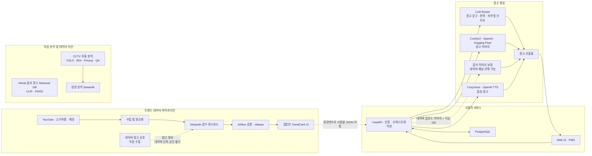

# BrandMate AI

소상공인의 업종, 상품, 광고 채널, 타깃, 분위기와 최신 트렌드를 입력받아 광고 문구, 이미지, 음성을 생성하고, 매장 전면 유동 데이터를 분석하는 E2E 광고 제작 및 상권 분석 서비스입니다.

[최종 프로젝트 보고서 보기](https://drive.google.com/file/d/1xuIoya-BDLyGxLTm8TnsaxeV0EMa3Om4/view?usp=drive_link)

## 목차

- [프로젝트 개요](#프로젝트-개요)
- [핵심 기능](#핵심-기능)
- [전체 서비스 구조](#전체-서비스-구조)
- [코드 실행 흐름](#코드-실행-흐름)
- [프로젝트 구조](#프로젝트-구조)
- [기술 스택](#기술-스택)
- [빠른 시작](#빠른-시작)
- [환경변수](#환경변수)
- [선택 기능 실행](#선택-기능-실행)
- [주요 API](#주요-api)
- [테스트](#테스트)
- [제출 자료](#제출-자료)
- [문서](#문서)
- [현재 구현 범위와 한계](#현재-구현-범위와-한계)
- [협업일지](#협업일지)

## 프로젝트 개요

BrandMate AI는 광고 제작에 필요한 여러 작업을 하나의 흐름으로 연결합니다.

1. SNS와 콘텐츠 사이트에서 트렌드 후보를 수집하고 사람이 검수합니다.
2. 사용자가 업종, 상품, 상황, 타깃, 광고 톤과 채널을 선택합니다.
3. FastAPI가 인증과 요청 검증을 처리하고 광고 문구 생성 모델을 호출합니다.
4. 구조화된 광고 문구와 비주얼 브리프를 바탕으로 이미지 프롬프트를 만듭니다.
5. ComfyUI, OpenAI 또는 Hugging Face 이미지 모델로 광고 이미지를 생성합니다.
6. 네이버 블로그 채널에서는 설정에 따라 업로드한 음식 사진을 보정한 뒤 새 배경과 합성합니다.
7. CosyVoice 또는 OpenAI TTS로 광고 문구를 음성 광고로 변환합니다.
8. 별도의 CCTV 분석 파이프라인이 매장 전면 유동량, ROI 관측량과 이동 후보를 집계합니다.

메인 광고 생성 경로는 `apps/web`과 `apps/api`가 담당합니다. 트렌드 데이터, 이미지 보정, 음성 합성, 음식 광고 검색 DB와 유동 분석은 독립적으로 실행할 수 있는 하위 서비스 또는 데이터 파이프라인으로 구성되어 있습니다.

## 핵심 기능

| 영역 | 기능 | 현재 실행 위치 |
| --- | --- | --- |
| 웹/PWA | 로그인, 광고 정보 입력, 채널·모델·TrendCard 선택, 결과 확인과 다운로드 | `apps/web` |
| 인증 | 회원가입, 로그인, JWT, 회전형 Refresh Token, 기기 세션, 비밀번호 재설정 | `apps/api/app/modules/auth` |
| 광고 문구 | 업종·상품·타깃·톤·채널을 반영한 문구, CTA, 해시태그, 전략과 비주얼 브리프 생성 | `apps/api/app/modules/ad_copy` |
| 광고 이미지 | ComfyUI, OpenAI, Hugging Face 제공자 중 설정된 경로로 이미지 생성 | `apps/api/app/extensions/ad_content` |
| 네이버 이미지 보정 | 업로드 음식과 접시 보존, 주변 물체 제거, 배경 생성과 합성 | `apps/api/food-image-cleanup-pipeline` |
| 음성 광고 | 한국어 숫자·단위 정규화, 음성 프리셋, 속도 조절, 재생과 다운로드 | `services/cosyvoice` |
| 트렌드 데이터 | YouTube·고구마팜·캐릿 등의 수집 코드, 검수 큐, processed 데이터 검증과 배포 | `gather_data`, `airflow` |
| 트렌드 검수 | TrendCard 후보의 `accept`, `reject`, `hold` 결정과 release DAG 호출 | `apps/review_dashboard` |
| 음식 광고 검색 DB | 음식 이미지 품질 필터, 캡션, CLIP 임베딩, FAISS 인덱스와 검색 API 구축 | `rag/aihub-food-ad-rag` |
| 상권 유동 분석 | YOLO 관측 결과 집계, 수동 ROI, 개인정보 보호 미디어, tracking·line crossing QA | `apps/visitor_flow_l2_dashboard`, `scripts` |
| 산출물 관리 | 광고 JSON·이미지·음성, 데이터 검증 결과와 분석 리포트 저장 | `outputs`, `data` |

## 전체 서비스 구조



`Retrieval DB`와 CCTV 유동 분석은 저장소에 포함된 독립 데이터/분석 경로입니다. 메인 광고 생성 API의 모든 요청이 이 두 경로를 자동 호출하는 구조는 아닙니다.

## 코드 실행 흐름

### 1. 광고 생성

```text
사용자 로그인
  -> 업종·상품·상황·타깃·톤·채널·모델 선택
  -> POST /api/v1/ad-content/generate
  -> Pydantic 요청 검증
  -> TrendCard 사용 여부 결정
     -> Instagram은 기본 사용
     -> 사용자가 기능을 켜거나 TrendCard ID를 지정해도 사용
  -> 사용하는 경우에만 TrendCard 조회
  -> 광고 문구 LLM 호출
  -> 구조화 결과 검증과 재시도 또는 fallback
  -> Product Visualizer fallback 결과와 visual_brief 정규화
  -> image prompt / negative prompt 생성
  -> 채널별 이미지 처리
     -> 일반 채널: 선택한 이미지 provider로 새 이미지 생성
        -> 설정된 경우 생성 이미지 검증과 재생성
     -> 네이버 블로그: 업로드 이미지 반환
        -> 이미지 보정 기능이 ON이면 음식 이미지 보정 파이프라인 실행
        -> 일반 채널용 validate_generated_image는 다시 실행하지 않음
  -> outputs/ad-content에 산출물 저장
  -> 문구·이미지·모델·검증 정보 응답
```

### 2. 음성 광고

```text
광고 문구 선택
  -> POST /api/v1/ad-content/audio/generate
  -> 숫자·시간·가격·단위의 한국어 발음 정규화
  -> CosyVoice 호출
  -> 긴 대본은 문장 단위로 나누어 생성 후 결합
  -> CosyVoice가 준비되지 않았고 fallback이 허용되면 OpenAI TTS 호출
  -> 브라우저 재생·다운로드용 음성 응답
```

### 3. 트렌드 수집과 검수

```text
YouTube·고구마팜·캐릿 landing 수집
  -> 스키마 정규화와 후보 점수 계산
  -> review queue 생성
  -> 검수자가 accept / reject / hold 결정
  -> Airflow가 processed v3 release 생성
  -> JSON·CSV 일관성, schema, 상태와 checksum 검증
  -> BRANDMATE_TREND_CARD_PAYLOAD_PATH에 사용할 v3 JSON 지정
  -> API를 재시작하면 FastAPI TrendCard loader가 지정된 JSON 사용

네이버 수집
  -> 독립 수집기로 참고 신호 생성
  -> 현재 네이버 landing 수집용 Airflow DAG는 없음
  -> 네이버 정보만으로 TrendCard를 승인하지 않음
```

FastAPI의 기본 설정은 processed v2 파일을 가리킵니다. Airflow가 만든 v3 release를 서비스에 적용하려면 `BRANDMATE_TREND_CARD_PAYLOAD_PATH`를 해당 v3 JSON으로 바꿔야 합니다.

### 4. 네이버 음식 이미지 보정

```text
네이버 블로그 채널 + 업로드 사진
  -> GroundingDINO와 YOLO로 음식·접시 후보 탐지
  -> SAM2와 선택적 HQ-SAM으로 마스크 생성
  -> 음식·접시 보존 알파와 안전 제거 마스크 생성
  -> Big-LaMA로 안전한 제거 영역만 복원
  -> 용기 경계와 접시 림 후처리
  -> SANA 배경 후보 생성
  -> OpenCLIP·규칙 기반 후보 검증
  -> 전경 배치·알파 합성·색상 조화
  -> 최종 JPG와 실행 리포트 저장
```

자세한 설정과 실패 상태는 [Food Image Cleanup Pipeline README](apps/api/food-image-cleanup-pipeline/README.md)를 참고하세요.

### 5. 상권 유동 분석

```text
CCTV 영상
  -> YOLO 사람 탐지 결과 생성 또는 기존 prediction 재사용
  -> frame·시간대별 관측량 집계
  -> 카메라별 수동 ROI 적용
  -> 개인정보 보호용 마스킹 이미지·영상 생성
  -> tracking ID와 line crossing 후보 QA
  -> Streamlit 대시보드와 고객용 리포트
```

이 분석 결과는 관측량과 QA 산출물이며, 곧바로 실제 방문자 수나 매출로 해석하지 않습니다.

## 프로젝트 구조

```text
final_1_team/
├─ apps/
│  ├─ api/                         FastAPI, 인증, 광고 문구·이미지·음성 오케스트레이션
│  │  └─ food-image-cleanup-pipeline/
│  │                                네이버 음식 사진 보정·배경 교체 파이프라인
│  ├─ web/                         메인 정적 웹 UI와 PWA
│  ├─ review_dashboard/            SNS TrendCard 검수 Streamlit 앱
│  ├─ visitor_flow_l2_dashboard/   상권 유동 분석 Streamlit 앱
│  └─ visitor_flow_eval_viewer/    유동 분석 평가 결과 뷰어
├─ airflow/                        트렌드 수집·검증·release DAG와 공통 검증 코드
├─ gather_data/                    소스별 수집기와 review queue 로직
├─ rag/aihub-food-ad-rag/          음식 광고 Retrieval DB 구축과 검색 API
├─ services/cosyvoice/             로컬 한국어 음성 광고 서비스
├─ configs/                        유동 분석 등 공통 설정
├─ data/                           landing·curated·processed 데이터와 DVC 대상
├─ outputs/                        광고·유동 분석·서비스 로그 산출물
├─ scripts/                        통합 실행, 배포, 평가와 분석 스크립트
├─ notebooks/                      데이터·모델 실험 노트북
├─ deploy/                         배포 관련 설정
├─ docs/                           아키텍처, API, 데이터셋과 운영 문서
├─ tests/                          저장소 공통 테스트
├─ docker-compose.api.yml          PostgreSQL 개발·테스트 구성
├─ docker-compose.airflow.yml      Airflow 구성
└─ start-brandmate.cmd             Windows 통합 실행 진입점
```

## 기술 스택

| 영역 | 기술 |
| --- | --- |
| Frontend | HTML, CSS, JavaScript, PWA, Service Worker |
| Backend | Python 3.11, FastAPI, Pydantic, Uvicorn |
| Database/Auth | PostgreSQL, SQLAlchemy, Alembic, JWT, Argon2id |
| Workflow/Data | Apache Airflow, DVC, GCS, Pandas, Parquet |
| LLM | OpenAI-compatible API, Hugging Face Router, NVIDIA NIM, Ollama/LM Studio 연동 |
| Image Generation | ComfyUI, FLUX.1, SDXL, OpenAI Image API, Hugging Face |
| Vision | YOLO11, GroundingDINO, SAM2, HQ-SAM, OpenCV, Big-LaMA, OpenCLIP, SANA |
| Audio | CosyVoice, OpenAI TTS, FFmpeg |
| Retrieval | CLIP, FAISS, BLIP, pHash |
| Dashboard | Streamlit |
| Test/Quality | pytest, Ruff, Node syntax check |
| Infra | Docker Compose, WSL2, CUDA, GCP GPU VM, Caddy/HTTPS tunnel |

## 빠른 시작

### 요구 사항

메인 웹과 API의 최소 요구 사항은 다음과 같습니다.

- Git
- Python 3.11 이상
- Docker Desktop 또는 Docker Engine과 Compose
- PostgreSQL 컨테이너를 실행할 수 있는 환경

다음 항목은 선택 기능에만 필요합니다.

- NVIDIA GPU와 CUDA: ComfyUI, 로컬 비전 모델, CosyVoice
- WSL2 Ubuntu: Windows에서 CosyVoice와 일부 GPU 런타임 사용
- GCS 자격 증명: Airflow가 GCS의 공식 데이터 패키지를 읽을 때
- 각 모델 제공자의 API 키: OpenAI, Hugging Face, NVIDIA NIM 등을 사용할 때

### Windows 통합 실행

PowerShell에서 저장소를 준비합니다.

```powershell
git clone <REPOSITORY_URL> final_1_team
cd final_1_team\apps\api

py -3.11 -m venv .venv
.\.venv\Scripts\python.exe -m pip install --upgrade pip
.\.venv\Scripts\python.exe -m pip install -e ".[dev]"
Copy-Item .env.example .env

cd ..\..
.\start-brandmate.cmd
```

`start-brandmate.cmd`는 다음 작업을 수행합니다.

1. Docker Desktop과 로컬 PostgreSQL을 확인합니다.
2. Alembic migration을 실행합니다.
3. FastAPI를 `127.0.0.1:7660`에서 실행합니다.
4. 정적 웹을 `127.0.0.1:5501`에서 실행합니다.
5. 로컬 관리자 계정을 준비하고 웹 브라우저를 엽니다.

브라우저를 자동으로 열지 않으려면 다음 명령을 사용합니다.

```powershell
.\start-brandmate.cmd -NoBrowser
```

### GCP 또는 WSL 통합 실행

`apps/api/.env.gcp.example`을 기준으로 실제 `.env`를 만든 뒤 실행합니다.

```bash
cp apps/api/.env.gcp.example apps/api/.env
./scripts/manage_brandmate_services_gcp.sh restart
```

상태, 로그와 종료 명령:

```bash
./scripts/manage_brandmate_services_gcp.sh status
./scripts/manage_brandmate_services_gcp.sh logs
./scripts/manage_brandmate_services_gcp.sh stop
```

이 스크립트는 PostgreSQL, migration, FastAPI, 정적 웹을 관리합니다. 설치 여부와 `START_*` 환경변수에 따라 ComfyUI, 상권 대시보드, 검수 대시보드, Airflow를 함께 실행하거나 건너뜁니다.

### 접속 주소

| 서비스 | 기본 주소 |
| --- | --- |
| Web/PWA | `http://127.0.0.1:5501` |
| FastAPI | `http://127.0.0.1:7660` |
| Swagger | `http://127.0.0.1:7660/docs` |
| API readiness | `http://127.0.0.1:7660/ready` |
| ComfyUI | `http://127.0.0.1:8188` |
| CosyVoice | `http://127.0.0.1:50000` |
| Trend review dashboard | `http://127.0.0.1:8502` |
| Visitor-flow dashboard | `http://127.0.0.1:8503` |
| Airflow | `http://127.0.0.1:8080` |

### 수동 실행

DB, API와 웹을 각각 실행해야 할 때 사용합니다.

```powershell
# 저장소 루트
docker compose -f docker-compose.api.yml up -d brandmate-postgres

cd apps\api
.\.venv\Scripts\python.exe -m alembic upgrade head
.\.venv\Scripts\python.exe -m uvicorn app.main:app --host 127.0.0.1 --port 7660
```

새 PowerShell 터미널에서:

```powershell
cd apps\web
..\api\.venv\Scripts\python.exe -m http.server 5501 --bind 127.0.0.1
```

## 환경변수

로컬 예시는 `apps/api/.env.example`, GCP 예시는 `apps/api/.env.gcp.example`에 있습니다. 실제 비밀값이 들어간 `apps/api/.env`는 Git에 커밋하지 않습니다.

| 환경변수 | 역할 |
| --- | --- |
| `BRANDMATE_ENVIRONMENT` | `local`, `staging`, `production` 실행 환경 |
| `BRANDMATE_DATABASE_URL` | PostgreSQL async 연결 주소 |
| `BRANDMATE_AUTH_SECRET_KEY` | JWT 서명 키 |
| `BRANDMATE_WEB_ORIGIN` | 허용할 메인 웹 origin |
| `BRANDMATE_ADDITIONAL_WEB_ORIGINS` | 추가 CORS origin 목록 |
| `BRANDMATE_LLM_BASE_URL`, `BRANDMATE_LLM_API_KEY` | 기본 OpenAI-compatible LLM endpoint |
| `BRANDMATE_OPENAI_API_KEY` | OpenAI 문구·Vision·이미지·TTS 기능 |
| `BRANDMATE_IMAGE_PROVIDER` | `comfyui`, `openai`, `huggingface` 등 이미지 provider |
| `BRANDMATE_COMFYUI_BASE_URL` | 로컬 또는 GCP ComfyUI 주소 |
| `BRANDMATE_VOICE_PROVIDER` | `cosyvoice` 또는 `openai` 음성 provider |
| `BRANDMATE_COSYVOICE_BASE_URL` | CosyVoice 서비스 주소 |
| `BRANDMATE_TREND_CARD_PAYLOAD_PATH` | FastAPI가 읽는 processed TrendCard JSON |
| `BRANDMATE_IMAGE_VALIDATION_ENABLED` | 생성 이미지 검증 hook ON/OFF |
| `BRANDMATE_NAVER_IMAGE_ENHANCEMENT_ENABLED` | 네이버 음식 이미지 보정 전체 ON/OFF |
| `BRANDMATE_NAVER_IMAGE_CLEANUP_PYTHON` | 이미지 보정 전용 Python 경로 |

운영 환경에서는 HTTPS, 긴 `BRANDMATE_AUTH_SECRET_KEY`, Secure Refresh Cookie, 이메일 인증, SMTP와 PostgreSQL 기반 rate limit 설정이 필요합니다.

## 선택 기능 실행

### 네이버 음식 이미지 보정 ON/OFF

이 기능은 메인 서비스의 네이버 블로그 채널에 연결된 선택 기능입니다. 다음 조건을 모두 만족할 때 업로드한 첫 번째 사진을 자동 보정합니다.

- 채널이 `naver_blog`
- 업로드 이미지가 존재
- `.env`에서 기능이 활성화
- 전용 Python, 의존성과 모델이 준비됨

`apps/api/.env`:

```dotenv
BRANDMATE_NAVER_IMAGE_ENHANCEMENT_ENABLED=true
BRANDMATE_NAVER_IMAGE_CLEANUP_ROOT=food-image-cleanup-pipeline
BRANDMATE_NAVER_IMAGE_CLEANUP_PYTHON=C:\path\to\pipeline\.venv\Scripts\python.exe
BRANDMATE_NAVER_IMAGE_CLEANUP_TIMEOUT_SECONDS=600
```

기능을 끄려면:

```dotenv
BRANDMATE_NAVER_IMAGE_ENHANCEMENT_ENABLED=false
```

파이프라인 설치:

```powershell
cd apps\api\food-image-cleanup-pipeline
python -m pip install -r requirements-local.txt
python -m scripts.download_models --models yolo sam2 big-lama openclip sana grounding-dino hq-sam
```

`.env`를 변경한 뒤에는 API를 재시작해야 합니다. 기능이 꺼져 있거나 실행에 실패하면 통합 광고 요청은 업로드 원본 이미지로 fallback합니다.

### CosyVoice

WSL2 Ubuntu에서:

```bash
cd services/cosyvoice
bash setup.sh
bash start.sh
```

CosyVoice가 준비되지 않았을 때 `BRANDMATE_COSYVOICE_FALLBACK_TO_OPENAI=true`이고 OpenAI 설정이 있으면 OpenAI TTS를 사용합니다.

### 트렌드 검수 대시보드

```bash
PYTHONPATH=gather_data conda run -n ssakda streamlit run apps/review_dashboard/sns_trend_review_app.py --server.port 8502
```

### 상권 유동 분석 대시보드

대시보드는 기존 분석 산출물을 읽으며 화면을 열 때 YOLO를 다시 추론하지 않습니다.

```bash
python -m streamlit run apps/visitor_flow_l2_dashboard/app.py --server.port 8503
```

분석 산출물 생성 방법은 [Visitor Flow Dashboard README](apps/visitor_flow_l2_dashboard/README.md)를 참고하세요.

### Airflow

Airflow는 YouTube·고구마팜·캐릿 수집 DAG, review queue, processed 검증과 release 작업을 담당합니다. 저장소 스크립트로 실행하면 첫 실행 때 비공개 `.env.airflow`와 필요한 키를 준비합니다.

```bash
bash scripts/airflow/up.sh
```

이미 유효한 `.env.airflow`를 직접 준비한 운영자만 `docker compose --env-file .env.airflow -f docker-compose.airflow.yml up -d --build`를 사용할 수 있습니다. 운영 규칙과 DAG 입력 계약은 [Airflow Onboarding](docs/AIRFLOW_ONBOARDING.md)을 참고하세요.

### 음식 광고 Retrieval DB

AIHub 음식 이미지에서 품질 필터, 중복 제거, 캡션, CLIP 임베딩과 FAISS 인덱스를 만듭니다. 이 경로는 메인 API의 모든 광고 요청에 자동 연결된 런타임이 아닙니다.

```powershell
cd rag\aihub-food-ad-rag
python app\retrieval_api.py
```

기본 확인 주소:

```text
http://127.0.0.1:7860/health
http://127.0.0.1:7860/categories
```

## 주요 API

모든 경로는 기본 `api_prefix=/api/v1`을 사용합니다. 광고 생성 관련 API는 로그인 후 발급받은 Access JWT가 필요합니다.

| Method | Path | 역할 |
| --- | --- | --- |
| `GET` | `/health` | 프로세스 상태 |
| `GET` | `/ready` | DB를 포함한 준비 상태 |
| `GET` | `/metrics` | 인증 관련 Prometheus 지표 |
| `POST` | `/api/v1/auth/signup` | 회원가입 |
| `POST` | `/api/v1/auth/login` | Access JWT와 Refresh Cookie 발급 |
| `POST` | `/api/v1/auth/refresh` | Refresh Token 회전 |
| `GET` | `/api/v1/auth/me` | 현재 사용자 조회 |
| `GET` | `/api/v1/ad-copies/models` | 광고 문구 모델 목록 |
| `GET` | `/api/v1/ad-copies/trend-cards` | TrendCard 목록 |
| `POST` | `/api/v1/ad-copies/generate` | 광고 문구 생성 |
| `GET` | `/api/v1/ad-content/image-models` | 이미지 모델 목록 |
| `POST` | `/api/v1/ad-content/images/generate` | 이미지만 생성 |
| `POST` | `/api/v1/ad-content/audio/generate` | 음성 광고 생성 |
| `POST` | `/api/v1/ad-content/generate` | 광고 문구와 이미지 통합 생성 |
| `POST` | `/api/v1/llm/generate` | 모델 런타임 LLM 호출 |
| `POST` | `/api/v1/image/generate` | 모델 런타임 이미지 호출 |

전체 요청·응답 계약은 실행 후 [Swagger](http://127.0.0.1:7660/docs) 또는 [API 문서](docs/API.md)에서 확인하세요.

## 테스트

### FastAPI

```powershell
cd apps\api
.\.venv\Scripts\python.exe -m pytest
.\.venv\Scripts\python.exe -m ruff check app tests
```

### Airflow와 저장소 공통 테스트

```bash
python -m pytest airflow/tests
python -m pytest tests
```

### 웹 정적 파일

```powershell
node --check apps\web\app.js
node --check apps\web\sw.js
```

이미지 보정, CosyVoice와 유동 분석은 모델·GPU·데이터 요구 사항이 다르므로 각 하위 README의 테스트 명령을 사용합니다.


## 문서

- [전체 아키텍처](docs/ARCHITECTURE.md)
- [Backend](docs/Backend.md)
- [API](docs/API.md)
- [로컬 AI 파이프라인 설치](docs/LOCAL_AI_PIPELINE_ONBOARDING.md)
- [Airflow 운영](docs/AIRFLOW_ONBOARDING.md)
- [GCS 데이터셋 규칙](docs/GCS_DATASET_CONVENTION_ONBOARDING.md)
- [모델 전략](docs/MODEL_STRATEGY.md)
- [평가](docs/EVALUATION.md)
- [Web/PWA](apps/web/README.md)
- [CosyVoice](services/cosyvoice/README.md)
- [네이버 음식 이미지 보정](apps/api/food-image-cleanup-pipeline/README.md)
- [음식 광고 Retrieval DB](rag/aihub-food-ad-rag/README.md)
- [상권 유동 분석](apps/visitor_flow_l2_dashboard/README.md)
- [광고 콘텐츠 확장 모듈](apps/api/app/extensions/ad_content/README.md)
- [광고 문구 모듈](apps/api/app/modules/ad_copy/README.md)
- [모델 런타임 구조](apps/api/app/modules/model_runtime/README.md)
- [LLM 실행 방식](apps/api/app/modules/model_runtime/llm/README.md)
- [이미지 실행 방식](apps/api/app/modules/model_runtime/image/README.md)
- [광고 콘텐츠 파이프라인](apps/api/app/modules/model_runtime/docs/AD_CONTENT_PIPELINE_README.md)
- [프롬프트 전략](apps/api/app/modules/model_runtime/docs/PROMPT_STRATEGY.md)
- [기준 브랜치 대비 변경점](apps/api/app/modules/model_runtime/docs/CHANGES_FROM_AD_COPY_MODEL_BRANCH.md)
- [기여 가이드](CONTRIBUTING.md)

## 현재 구현 범위와 한계

- 메인 광고 생성은 실제 모델 provider를 호출하는 동기식 MVP입니다. 긴 이미지 생성 작업을 위한 job queue와 worker 분리는 아직 없습니다.
- 광고 산출물은 기본적으로 로컬 `outputs/ad-content`에 저장합니다. 다중 서버 운영에서는 object storage가 필요합니다.
- 일반 채널의 생성 이미지 검증은 설정형 hook이며 기본값은 `false`입니다. 네이버 분기에서는 이 검증 함수를 별도로 호출하지 않습니다.
- 현재 메인 광고 생성 요청은 Product Visualizer의 fallback만 사용합니다. 고급 reference 분석과 음식 Retrieval DB는 메인 요청 경로에 연결되어 있지 않습니다.
- 네이버 이미지 보정은 모델과 GPU 메모리가 준비된 환경에서만 사용하며, 기본 스위치는 `false`입니다.
- 상권 유동 분석은 관측·검수용 POC입니다. 카메라별 ROI와 추적 품질 검증 없이 실제 방문자 수로 단정하지 않습니다.
- 저장소에는 별도의 공개 라이선스 파일이 없습니다. 외부 사용과 배포 전에는 팀의 라이선스 정책을 확인해야 합니다.

## 협업일지

- 김영성 : [https://velog.io/@csd1345/2026-07-01-협업일지](https://velog.io/@csd1345/2026-07-01-%ED%98%91%EC%97%85%EC%9D%BC%EC%A7%80)
- 김태민 : [397e900739a3804f833cde2f8ac82ff1](https://app.notion.com/p/397e900739a3804f833cde2f8ac82ff1?source=copy_link)
- 박채빈 : [397e900739a38014ad40d949e8a96b85](https://app.notion.com/p/397e900739a38014ad40d949e8a96b85?source=copy_link)
- 안수진 : [397e900739a380aca6ccc01c1efa4159](https://app.notion.com/p/397e900739a380aca6ccc01c1efa4159?source=copy_link)
- 양기우 : [397e900739a380e5955bdd2741b6057b](https://app.notion.com/p/397e900739a380e5955bdd2741b6057b?source=copy_link)
